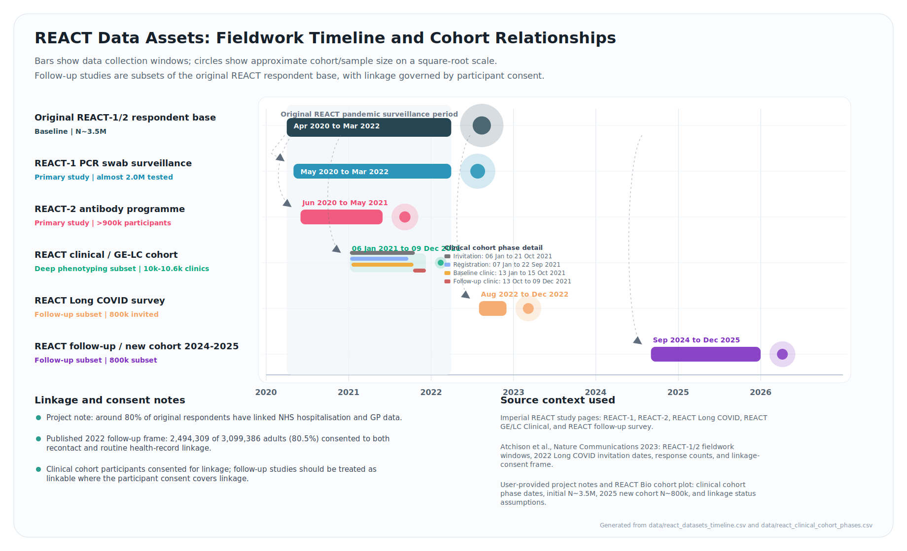

# REACT Enclave Projects

This repository contains documentation and supporting assets for using an enclave server for REACT data analysis.

## Working on the Enclave Server

The main working drive on the enclave server is:

```text
D:/
```

All analysis code, notebooks, derived outputs, and documentation should be saved in the shared project area:

```text
D:/projects
```

For HDA 2026 students, project-specific working folders have been created under:

```text
D:/projects/hda_2026
```

Students should work inside their assigned folder in `D:/projects/hda_2026`. This is important: supervisors cannot reliably access code, review outputs, or transfer files on and off the enclave if work is saved in personal folders.

### Folder Layout

| Location | Purpose | Notes |
| --- | --- | --- |
| `D:/` | Main enclave working drive | Start here when orienting yourself on the server. |
| `D:/projects` | Shared project workspace | All project work should be saved here. |
| `D:/projects/hda_2026` | HDA 2026 student project folders | Use your assigned subfolder for code, notebooks, logs, and derived outputs. |
| `D:/saved_objects` | Stored REACT datasets and prepared data objects | We will direct you to the correct dataset object or objects for your project. |

### Data Access

The REACT datasets are saved in:

```text
D:/saved_objects
```

Students should not move, rename, or overwrite the source data objects. For each project, supervisors will identify the correct dataset or datasets to use. Analysis outputs should be written back to the relevant project folder under `D:/projects/hda_2026`, not to the source data directory.

### Transferring Files On and Off the Server

Students do not have permission to transfer files on or off the enclave server because of data restrictions.

Files for export should be placed in the transfer area:

```text
D:/projects/hda_2026/TRANSFER
```

There is a named folder inside `TRANSFER` for each student. Put any files that you want transferred off the server into your own folder, for example plots, model summaries, aggregate tables, or presentation-ready outputs. Your supervisor will review and transfer approved files into a shared OneDrive folder.

We aim to process transfers once a week. Urgent transfers can be requested from your supervisor when needed.

You must not transfer row-level data off the server. This includes individual-level extracts, record-level tables, or any output that could disclose participant-level information.

### Compute Access

The enclave server has GPUs available. GPU access can be arranged for projects that require it, for example deep learning, large language model work, or other compute-intensive analyses.

## REACT Data Assets



The timeline is generated from [`data/react_datasets_timeline.csv`](data/react_datasets_timeline.csv) using [`scripts/create_react_timeline.py`](scripts/create_react_timeline.py).
